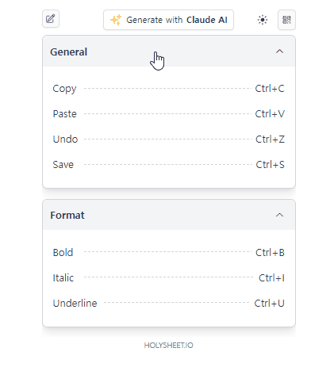

# HolySheet.IO: Shortcut sheet Organizer with Claude AI spoonfeeding setup

To survive the job competition against AI Robot,

you must at least use shortcuts to increase your productivity and speed.

Many people try to learn shortcuts. Even in the 21st century,
they're stuck in an endless cycle of searching blogs, organizing, editing, printing, and getting exhausted,
eventually giving up on remembering and trashing the shortcut cheat sheets.

We need a brain-dead easy anti-exhaustion note tool.

that's why HolySheet was born: to save humanity.



[Visit HolySheet.IO](https://holysheet.io)

## Features

### 1. Shining Beautiful UI
- Elegant and easy-to-read layout for all your shortcut needs.
- Do you think this UI doesn't look nice? That's a bug! It will be patched soon.


### 2. Supports shortcuts for apps that even I have never heard of
- Just type the software name and go.
- Claude AI will spoon-feed the shortcuts to you.

- Use the time saved by this tool to play games you bought on Steam but never played.


### 3. Intuitive WYSIWYG Drag Editing: Even a Chimp Can Use It
- Your next-door granny has already mastered this tool.
- Change the order by dragging, and write by double-clicking.


### 4. Mobile Necromancer: Bringing Dead Phones Back to life
- It supports QR codes to share your shortcut sheet.
- Scan QR with your phone and hang it next to your monitor.


### 5. Green Eco Friendly: Save the Coke bear
- Eco-friendly shortcut learning: Save trees by ditching printed cheat sheets.
- However, I also respect the preferences of those who enjoy destroying the earth environment.
  It's also printable.


### 6. Side Effects
My wife uses this to memorize business terms.
Users' ways of utilizing software are sometimes unpredictable.

Whatever the case, if it's used well, it's an excellent software.

------

## FAQ

- Yes, of course, a standalone desktop program version is coming soon.
- This was created in a week, so it has many shortcomings. But it should improve in the coming weeks.
- A Mac version is also planned. For now, if you tell Claude it's for Mac shortcuts, it will create them accordingly."


## 💌 Dear Claude Contest

> 🌟HolySheet is an old idea of mine.
> realized that mixing Claude with my old ideas makes them even more amazing.
> On July 3rd, I found out about the Claude Contest through Facebook,
> and the contest became a great motivation to put this project into real action.

> Releasing the project within a week was a challenge.
> I could have thought of better configurations, like using pre-collected software shortcuts and RAG and caching etc..
> but because the contest duration was short, I focused on completion first.

> This program is not just a one-time showcase demo project for the contest only.
> It's a program I created out of my necessity, and it is planned to be offered as a public freeware service.
> Personally, I'm a bit hesitant about public release due to the cost of LLM calls.
> Therefore, giving me an award will complete the final piece of the puzzle.
> The fate of humanity now rests in the hands of the Claude judges!


## Getting Started Development

1. Install dependencies:
```bash
npm install
```

2. Build the project:
```bash
npm run build
```

3. Run the code:
```bash
node .output/server/index.mjs
```

## Author

- **Name:** Kiyoung Jung
- **GitHub:** [https://github.com/fxpoet/holysheet.io](https://github.com/fxpoet/holysheet.io)
- **Email:** im@fxpoet.com

